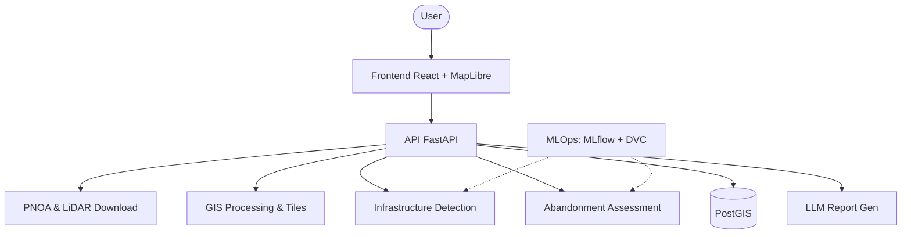
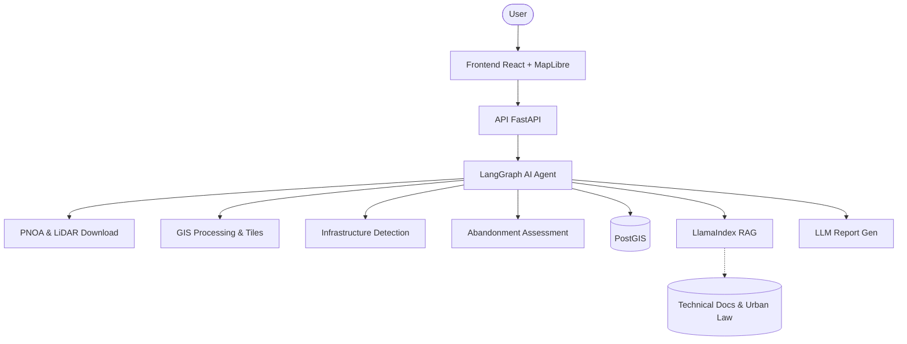

# System Architecture

> High-level architecture of the system. Updated whenever architectural changes are made.

## Overview

<!-- Describe the overall system architecture -->

## Component Diagram

### MVP (v1.0) Architecture

### Extended Version (v2.0) Architecture

## Data Flow

<!-- Describe how data moves through the system -->

## Key Design Decisions

<!-- Reference relevant ADRs from architecture/adr/ -->

## Deployment Architecture

<!-- Describe the deployment model (Docker, Docker Compose, etc.) -->

## Related Documents

- [Technology Stack](stack.md)
- [ADR Index](adr/README.md)
- [Project Context](../project_context.md)
